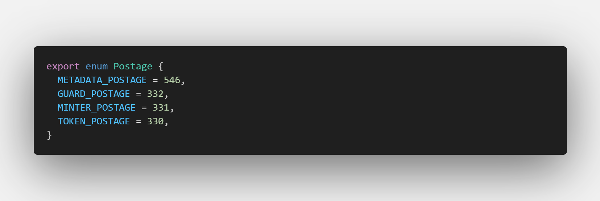
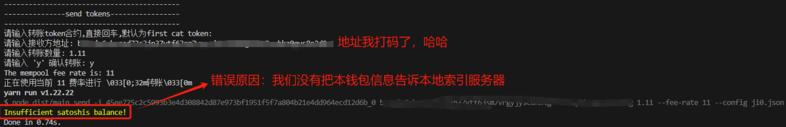
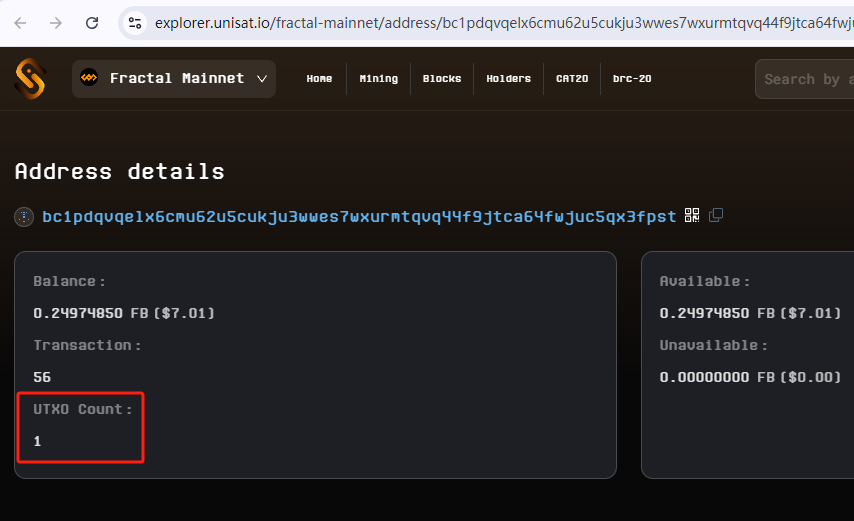
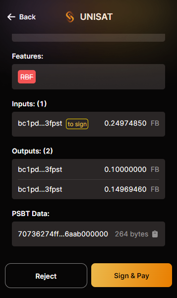
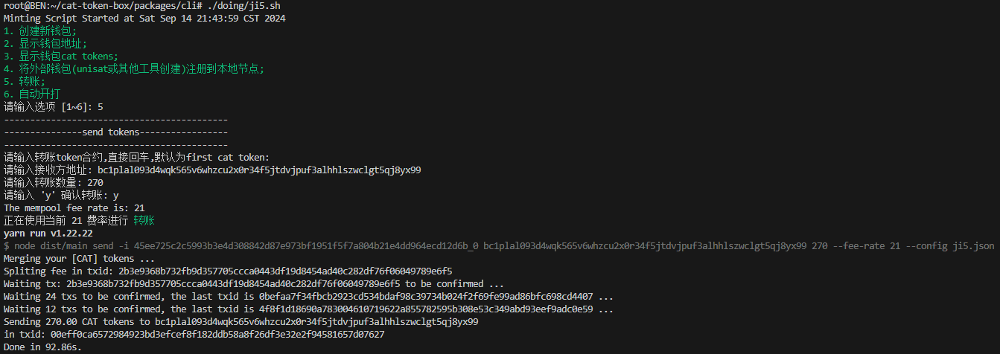
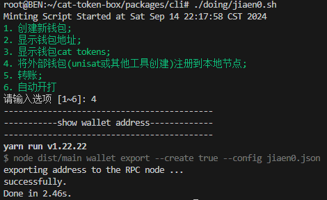

# Cat20代币转账及疑难杂症教程
- [不想听废话，点我直入主题](#1正常转账教程)
## 前言
Cat20协议的第一个代币在今天凌晨打完，各路科学家都是神仙打架，简单梳理了一下，大致有几种科技:
- **屏蔽merge省gas**
这个问题是在打完几笔之后，发现有几笔交易的费用很高，看了一些群，大家都发现这样的问题，后来看了下日志，发现有merge的操作，罪魁祸首就是它，通过阅读官方的白皮书，有提到代币merge是为了方便管理utxo，并且随时可以做merge，那就说明mint阶段的merge是完全可以移除的，于是对merge代码进行了修改，将下方`if (tokenContracts.length > 1) {`改为`if (tokenContracts.length > 9999) {`即可，这就意外着不会触发merge过程了，其实更粗暴的方式是把mint函数中的merge函数调用删除。
```
async merge(metadata, address) {
        const res = await (0, common_1.getTokens)(this.configService, this.spendService, metadata, address);
        if (res !== null) {
            const { contracts: tokenContracts } = res;
            if (tokenContracts.length > 1) {
                const cachedTxs = new Map();
```
- **修改output minter数量省gas**
默认一笔交易产生**2个output minter**，也就是说，默认打的情况下，minter utxo会呈现2^n指数级增长，到后面可用的**utxo越来越多**，其实就没必要再生成minter了，修改output的输出为1甚至0（*断子绝孙打法*），可以稍微省一点gas，百分之几，哈哈哈。
~~不过我很希望下次哪个大哥把这个参数改成999，你一次mint就能生成999个可用minter了，为社区做贡献，哈哈~~
修改了项目目录下的这个js文件内容
`packages\cli\dist\commands\mint\mint.command.js`
```
const mintTxIdOrErr = await (0, ft_open_minter_1.openMint)(this.configService, this.walletService, this.spendService, feeRate, feeUtxos, token, 2, minter, amount);
```
将上方的数值2替换为0或1，就能实现稍省gas的功能
- **修改收件人地址，制造垃圾utxo？**
昨天看到了说dotSwap平台打cat，制造了几十万的minter utxo垃圾，有可能是他们代打平台式托管代打的方式，造成了这个错误。通过阅读代码，发现可以通过修改输出的minter utxo的参数，例如将331sats修改为1sats，即可达到攻击的目的。以上只是猜测，实际流程我没去跑，没有印证修改sats是否能制造utxo垃圾。

# 好了废话说完了，开始我们的转账教程
## 1.正常转账教程
使用send命令，填写正确参数即可转账，该过程，会自动对token进行merge，无需担心之前没开merge，这里转不了的情况
**命令格式:**`sudo yarn cli send -i $token $receiver $amount --fee-rate $feeRate`
**示例:**`send -i 45ee725c2c5993b3e4d308842d87e973bf1951f5f7a804b21e4dd964ecd12d6b_0 bc1pxxx 250 --fee-rate 40`
- `$token`:代币合约地址，例如我们这次打的cat，其合约为:`45ee725c2c5993b3e4d308842d87e973bf1951f5f7a804b21e4dd964ecd12d6b_0`
- `$receiver`:接收方的taproot地址，这里建议使用taproot格式，钱包地址的m/44和m/86不用管，不影响转账结果，只需要保证地址格式正确即可
- `$amount`:要发送的数量，小数或者整数都可以，如果数量比较大，例如400，建议拆分成几次发送，例如每次发200，因为转账过程也是需要等待merge结果的，干脆分为几次发送，不影响结果
- `$feeRate`:交易gas费，使用下文的脚本，可自动获取当前链上当前gas，并使用当前gas交易
### 很多小伙伴可能遇到了`Insufficient satoshis balance!`的错误:

查看代码，发现是由于获取可以utxo的服务，没有获取到可用的utxo，有两个原因:
1. 节点索引未同步完全
这种情况只能等待节点同步完成，我没有去深究。
2. 钱包utxo有且为1

使用任意钱包，向本钱包再转一笔FB即可，例如:0.5FB，够归集的费用就行了。需要注意的是，得等到转账确认之后，再去尝试cat代币的转账

完成上述步骤后，即可愉快的转账了

## 2.我只有钱包助记词，怎么转账？
很多小伙伴估计都遇到了节点服务器爆硬盘（64G大内存，都给我爆了）的窘境，本人昨天就是这样，导致后半场只能观火！！！
**现在我只有助记词，怎么进行转账啊？**
当前只有一种方式，那就是重新部署环境，等待节点同步完成，导入助记词，进行转账，不会这些操作的老哥，只能等待后续第三方服务支持转账功能了。或者找代转的老哥，担保啥的
#### 下面我给大家讲一下，部署好环境，只有助记词怎么导入到环境，然后进行转账
**流程如下:**
##### 1. 在`packages/cli`目录下，找到`wallet.json`文件，修改里面的内容:
```
{
    "accountPath": "m/86'/0'/0'/0/0",
    "name": "cat-coffee",
    "mnemonic": "found this helpful you could treat me to a cup of coffee"
}
```
- `accountPath`:最新版的格式为:`m/86'/0'/0'/0/0`,如果你使用的是老版项目创建的钱包，需将此处改为:`m/44'/0'/0'/0/0`
- `name`:钱包名称，改成你想要的名字即可，注意使用英文
- `mnemonic`:助记词，你新建的外部钱包地址，或者unisat地址
##### 2. 将钱包挂载到本地服务
导入助记词之后，并不意味着钱包就可以使用了，还需要使用export命令挂载钱包，操作如下：
**执行:**`sudo yarn cli wallet export --create true`

上述命令适用于首次导入助记词的钱包，如果你是修改了助记词，则无需创建钱包缓存，使用下述命令即可：
**执行:**`sudo yarn cli wallet export`
##### 3. 快乐的转账
此流程参考[1.正常转账教程](#section1)


## 3.觉得输入命令很麻烦？不妨用用我写的脚本吧
1. 将`demo.json`文件与`overOpen`文件夹，拷贝到`packages/cli`目录下；
2. 运行脚本之前需要给脚本添加执行权限：`chmod +x ./overOpen/demo.sh`
3. 在命令行cd到`packages/cli`目录，输入`./overOpen/demo.sh`即可运行脚本；
**注意:** 需要多开的小伙伴，可以自行研究，并且`autoGas.sh`脚本肯定能帮上大忙
有任何疑问欢迎联系我：https://x.com/jujubemelon
###### 觉得本文对你有帮助的话，可以请我喝杯咖啡，哈哈，肝了几个小时弄出来的教程，第一次写，有疑问的地方，欢迎留言
请你喝杯咖啡：
BTC:`bc1p2jq6h7syt03hvm4c3mcxhpa4j6wtxf96h8jv4gakngfvamm2trcqyd58dw`

ETH:`0x8d92d168ac7f66c97316ea02138870b2393c403f`

SOL:`ykdmHZi5gYybcj8BaaartqYkfghuHTiDkDsiVhikgfd`

**我要和你深入交流，weChat：**


